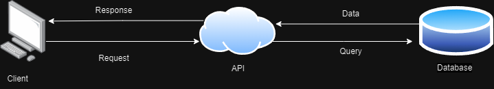

# Project Title : Mock Test FSW Binar
For completing CDP Binar

# Answer 
1. Apakah Kegunaan JSON pada REST API?
JSON berguna untuk client & server untuk berkomunikasi, bertukar data. Client mengirimkan JSON dengan istilah request, lalu server memproses request dan mengembalikan JSON dengan istilah response.

2. Jelaskan bagaimana REST API bekerja

    1. Client melakukan request, dengan mengirimkan endpoint API, JSON sesuai format yang dapat dibaca oleh API, biasanya endpoint API, format request API dapat dilihat di API documentation.  
    2. Request akan diterima oleh API. Biasanya akan ada proses validasi request sebelum melanjutkan ke proses selanjutnya. 
    3. Jika lolos validasi dan jika dibutuhkan API melakukan query ke database sesuai request dari client.
    4. Database akan mengembalikan query result sesuai query yang dilakukan.
    5. Data yang diterima dari database, akan diolah terlebih dahulu pada API menjadi bentuk JSON sebagai response. Bentuk response juga biasanya dapat dilihat pada API documentation.
    6. Response dikirim kembali kepada client.

# Feature description
1. Login Form
2. Regist Form
3. Todo App 

        1. Get Todo item
        2. Add Todo item
        3. Edit Todo item
        4. Delete Todo item
4. Misc : refresh token every 25 min

# App Url
TBD

# How to use App 
1. Go to App Url
2. You can create new user with Registration or login using this account 

        1. username : mocktestbinar
        2. pin : 123456
After that, click Login

3. Input your to do item in "add item" field and click "Add"
4. You can edit your to do item, select the to do item, and pop up promp will show. 
5. You can also delete your to do item. 
6. Logout if there's nothing to do left

# API Documentation
TBD

# References
Login & Registration Form :
https://bootcamp.uxdesign.cc/build-react-login-sign-up-form-ui-with-bootstrap-5-7288c8ca15b7

Todo App : 
https://www.geeksforgeeks.org/create-todo-app-using-reactjs/

Redux tutorial : 
https://medium.com/codeacademia/tutorial-redux-bagian-i-membuat-todo-list-c26a979d0a1f

